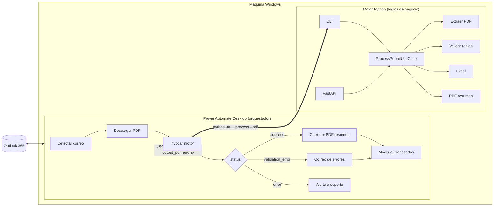
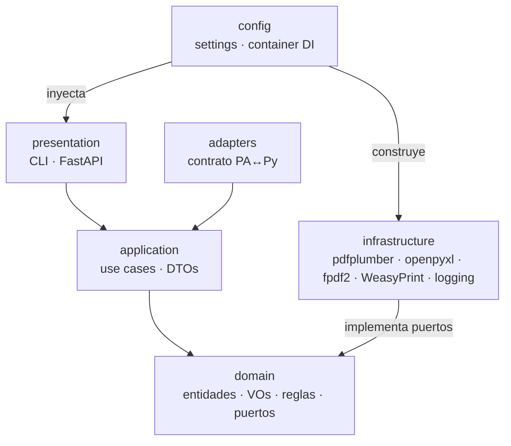
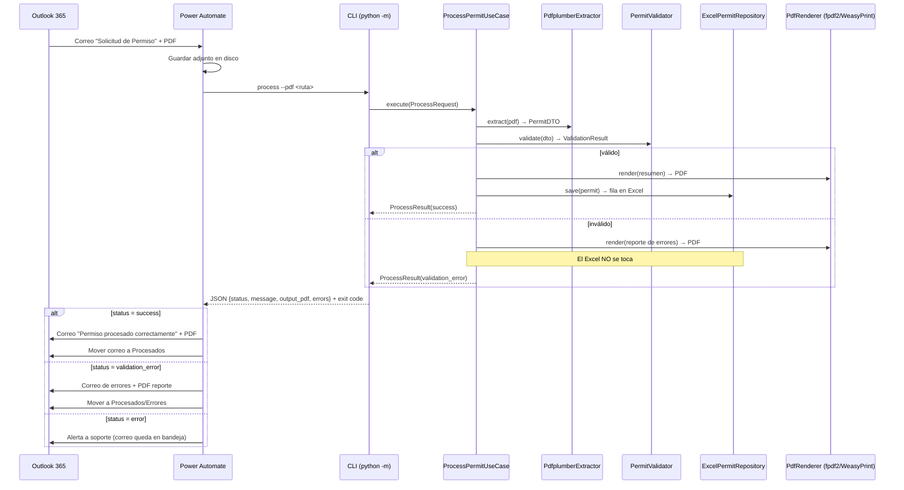

# Documento de Arquitectura

Sistema RPA de procesamiento de permisos: **Power Automate Desktop orquesta,
Python decide**. Este documento describe los componentes, sus responsabilidades,
el flujo de datos y las dependencias.

---

## 1. Visión general

El sistema aplica **Clean Architecture** con el principio **API First**: existe un
único núcleo de negocio en Python, expuesto por dos adaptadores intercambiables
(CLI y HTTP), y un orquestador externo (PAD) que solo coordina eventos de Outlook.



## 2. Componentes y responsabilidades

| Componente | Ubicación | Responsabilidad | NO hace |
|---|---|---|---|
| **Orquestador PAD** | `power_automate/` | Detectar correos, descargar adjuntos, invocar el motor, enviar correos, mover mensajes | Validar, extraer, decidir reglas de negocio |
| **CLI** | `presentation/cli/` | Traducir argumentos → caso de uso → JSON por stdout + exit code | Lógica de negocio |
| **API HTTP** | `presentation/api/` | Traducir HTTP → caso de uso → JSON body | Lógica de negocio |
| **Contrato** | `adapters/contract.py` | Mapeo único resultado interno → JSON + exit codes | — |
| **Caso de uso** | `application/use_cases/` | Orquestar extraer → validar → persistir → renderizar | Conocer implementaciones concretas |
| **Dominio** | `domain/` | Entidades, Value Objects, reglas de negocio, puertos | I/O de cualquier tipo |
| **Infraestructura** | `infrastructure/` | pdfplumber, openpyxl, fpdf2/WeasyPrint, logging | Decidir reglas |
| **Configuración/DI** | `config/` | Cargar config.yaml + .env; ensamblar el grafo de objetos | — |

## 3. Regla de dependencias

Las dependencias apuntan **hacia adentro**; el dominio no conoce a nadie:



- `domain` define **puertos** (interfaces ABC): `PdfExtractor`, `PermitRepository`, `PdfRenderer`.
- `infrastructure` los **implementa**; `config/container.py` es el único punto de unión.
- Cambiar Excel→BD, pdfplumber→OCR o fpdf2→WeasyPrint no toca `application` ni `domain`.

## 4. Flujo end-to-end (secuencia)



## 5. El contrato de integración

La pieza que desacopla orquestador y motor. Definido en `adapters/contract.py` y
`application/dto/process_response.py`:

```json
{
  "status": "success | validation_error | error",
  "message": "Permiso PER-001245 procesado correctamente.",
  "process_id": "20260721-120000",
  "folio": "PER-001245",
  "output_pdf": "C:\\...\\PER-001245_20260721-120000.pdf",
  "errors": [{"campo": "...", "regla": "...", "detalle": "..."}]
}
```

| Canal | Transporte del contrato |
|---|---|
| CLI | stdout (JSON) + exit code 0 / 2 / 1 |
| API | body JSON + HTTP 200 (negocio) / 500 (técnico) |

**Consecuencia arquitectónica**: PAD puede sustituirse por UiPath, un cron, o un
consumidor de colas sin modificar una línea del motor.

## 6. Dependencias externas

| Dependencia | Capa | Uso |
|---|---|---|
| pdfplumber | infrastructure | Extracción de texto del PDF |
| openpyxl | infrastructure | Lectura/escritura del Excel maestro |
| fpdf2 | infrastructure | Render PDF portable (default) |
| WeasyPrint + Jinja2 | infrastructure | Render PDF HTML/CSS (opcional, requiere GTK) |
| Pydantic / pydantic-settings | application, config | DTOs, contrato, settings tipados |
| FastAPI + uvicorn | presentation | Adaptador HTTP |
| PyYAML | config | Carga de config.yaml |

## 7. Decisiones de arquitectura

Registradas como ADRs en [adr/](adr/):

- [ADR-001 Clean Architecture](adr/ADR-001-clean-architecture.md)
- [ADR-002 Power Automate solo como orquestador](adr/ADR-002-power-automate-orquestador.md)
- [ADR-003 Contrato CLI + FastAPI sobre el mismo core](adr/ADR-003-contrato-cli-fastapi.md)
- [ADR-004 Excel como persistencia del MVP](adr/ADR-004-excel-persistencia.md)
- [ADR-005 Repository Pattern](adr/ADR-005-repository-pattern.md)
- [ADR-006 Strategy para el motor PDF](adr/ADR-006-strategy-motor-pdf.md)
