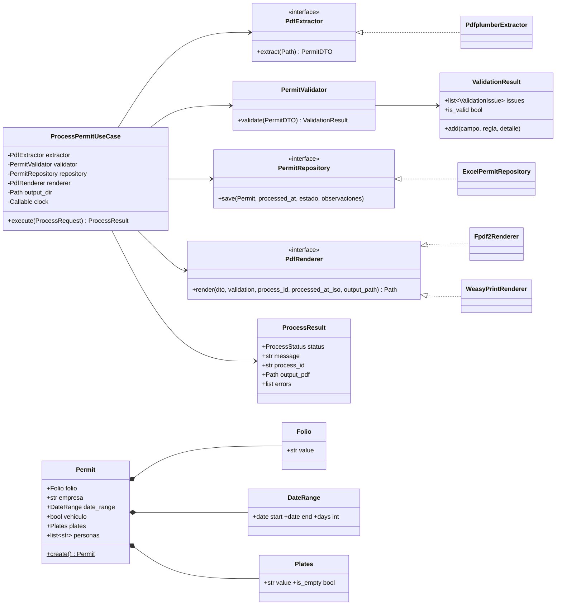

# TDD — Technical Design Document

**Proyecto:** RPA Procesamiento de Permisos · **Versión:** 1.1.0

Detalle técnico de módulos, clases, interfaces, APIs, modelos y validaciones.
Complementa a [ARCHITECTURE.md](ARCHITECTURE.md) (visión) y al
[MANUAL_TECNICO.md](MANUAL_TECNICO.md) (recorrido por módulo).

---

## 1. Mapa de módulos

```
src/permits/
├── domain/                      ← sin dependencias externas (puro Python)
│   ├── entities/        Permit · ValidationResult · ProcessResult
│   ├── value_objects/   Folio · DateRange · Plates
│   ├── ports/           PdfExtractor · PermitRepository · PdfRenderer  (ABC)
│   ├── services/        PermitValidator
│   └── exceptions.py    DomainError y derivadas
├── application/                 ← depende solo de domain
│   ├── dto/             PermitDTO · ProcessRequest · ProcessResponse  (Pydantic)
│   └── use_cases/       ProcessPermitUseCase
├── infrastructure/              ← implementa los puertos
│   ├── extraction/      PdfplumberExtractor
│   ├── persistence/     ExcelPermitRepository
│   ├── rendering/       Fpdf2Renderer · WeasyPrintRenderer · renderer_factory
│   └── logging/         configure_logging()
├── adapters/            contract.py  (EXIT_CODES · to_response · to_exit_code)
├── presentation/
│   ├── cli/main.py      argparse → use case → JSON stdout + exit code
│   └── api/             create_app() · routers/permits.py
└── config/              Settings (yaml+env) · Container (DI)
```

## 2. Diagrama de clases



## 3. Modelos (Pydantic)

### 3.1 `PermitDTO` — datos crudos extraídos
| Campo | Tipo | Default | Nota |
|---|---|---|---|
| folio | `str` | `""` | Sin validar (eso lo hace el validador) |
| empresa | `str` | `""` | |
| fecha_inicio | `date \| None` | `None` | `None` si no parseable |
| fecha_fin | `date \| None` | `None` | |
| vehiculo | `bool` | `False` | "Si/Sí/true/1/x/yes" → True |
| placas | `str` | `""` | |
| personas | `list[str]` | `[]` | |

### 3.2 `ProcessResponse` — **el contrato**
| Campo | Tipo | Ejemplo |
|---|---|---|
| status | `str` | `success` · `validation_error` · `error` |
| message | `str` | "Permiso PER-001245 procesado correctamente." |
| process_id | `str` | `20260721-120000` (timestamp de la corrida) |
| folio | `str \| null` | `PER-001245` |
| output_pdf | `str \| null` | ruta absoluta del PDF generado |
| errors | `list[{campo, regla, detalle}]` | `[]` en éxito |

## 4. Interfaces (puertos)

| Puerto | Método | Lanza | Implementación |
|---|---|---|---|
| `PdfExtractor` | `extract(pdf_path) -> PermitDTO` | `ExtractionError` | `PdfplumberExtractor` |
| `PermitRepository` | `save(permit, *, processed_at, estado, observaciones)` | `PersistenceError` | `ExcelPermitRepository` |
| `PdfRenderer` | `render(*, dto, validation, process_id, processed_at_iso, output_path) -> Path` | `RenderingError` | `Fpdf2Renderer`, `WeasyPrintRenderer` |

`PdfRenderer` recibe el **DTO crudo** (no la entidad) deliberadamente: el PDF de
reporte de errores debe generarse también para datos que no pueden construir una
entidad válida.

## 5. Validaciones

Dos niveles complementarios:

1. **Estructurales (Value Objects)** — imposible construir un valor inválido:
   `Folio` (no vacío, `[A-Za-z0-9-]`), `DateRange` (start < end),
   `Plates` (formato, mayúsculas).
2. **De negocio (PermitValidator)** — acumulativas sobre el DTO crudo:
   RN-01…RN-05 del [SDD](SDD.md#4-reglas-de-negocio). Devuelve
   `ValidationResult` con TODOS los fallos.

El caso de uso solo construye la entidad `Permit` cuando el validador aprobó,
por lo que los VOs actúan como segunda barrera (defensa en profundidad).

## 6. API HTTP

Base: `http://127.0.0.1:8000` · Swagger: `/docs`

| Método | Ruta | Request | Response | HTTP |
|---|---|---|---|---|
| GET | `/health` | — | `{status, app, environment}` | 200 |
| POST | `/api/v1/permits/process` | `{"pdf_path": "..."}` | `ProcessResponse` | 200 negocio / 500 técnico |
| POST | `/api/v1/permits/process/upload` | multipart `file` | `ProcessResponse` | 200 / 500 |

## 7. CLI

```
python -m permits.presentation.cli.main process --pdf <ruta>
```

| Canal | Contenido |
|---|---|
| stdout | Únicamente el JSON del contrato (UTF-8, indentado) |
| stderr | Logs (formato `%(asctime)s \| %(levelname)-8s \| %(name)s \| %(message)s`) |
| exit code | `0` success · `2` validation_error · `1` error |

## 8. Configuración

Precedencia: defaults → `config.yaml` → `.env` (prefijo `PERMITS_`, anidación `__`).

| Clave | Default | Uso |
|---|---|---|
| `paths.excel_file` | `data/permisos.xlsx` | Excel maestro |
| `paths.output_dir` | `sample_data/expected_output` | PDFs generados |
| `paths.logs_dir` | `logs` | Logs diarios |
| `paths.templates_dir` | `templates` | Plantillas Jinja2 |
| `pdf.renderer` | `fpdf2` | Estrategia de render |
| `logging.level` | `INFO` | Nivel raíz |
| `excel.sheet_name` / `excel.headers` | `Permisos` / 10 columnas | Estructura del Excel |

Las rutas relativas se resuelven contra la raíz del proyecto
(`config/settings.py::PROJECT_ROOT`), nunca contra el CWD.

## 9. Logging

- `TimedRotatingFileHandler` con rotación a medianoche, 30 días de retención:
  `logs/permits.log` → `permits.log.2026-07-21`.
- Consola (stderr) activable por config.
- Niveles usados: `DEBUG` (datos extraídos), `INFO` (hitos), `WARNING`
  (validación fallida), `ERROR` (fallos técnicos).

## 10. Estrategia de pruebas

| Tipo | Carpeta | Qué cubre | Dobles |
|---|---|---|---|
| Unit | `tests/unit/` | VOs, validador (8 casos), contrato/exit codes | — |
| Integración | `tests/integration/` | Use case end-to-end; extractor contra PDF real; repositorio contra xlsx real; API con TestClient | `FakeExtractor`, `InMemoryRepository`, `FakeRenderer` (en `conftest.py`) |

34 tests. Reloj inyectado (`clock`) para timestamps deterministas.
