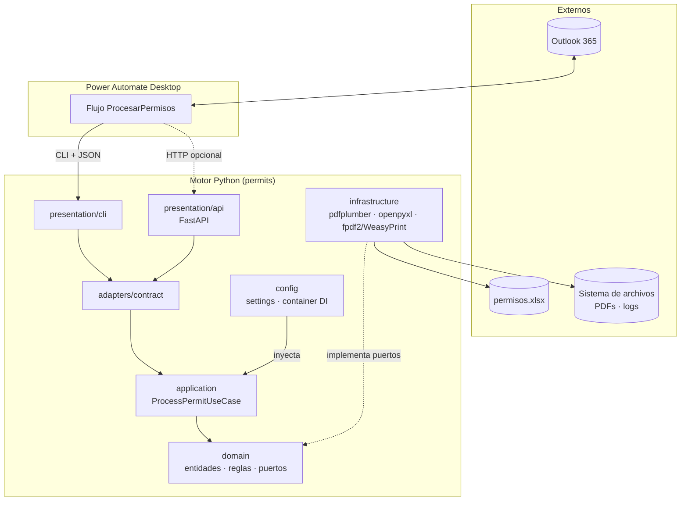
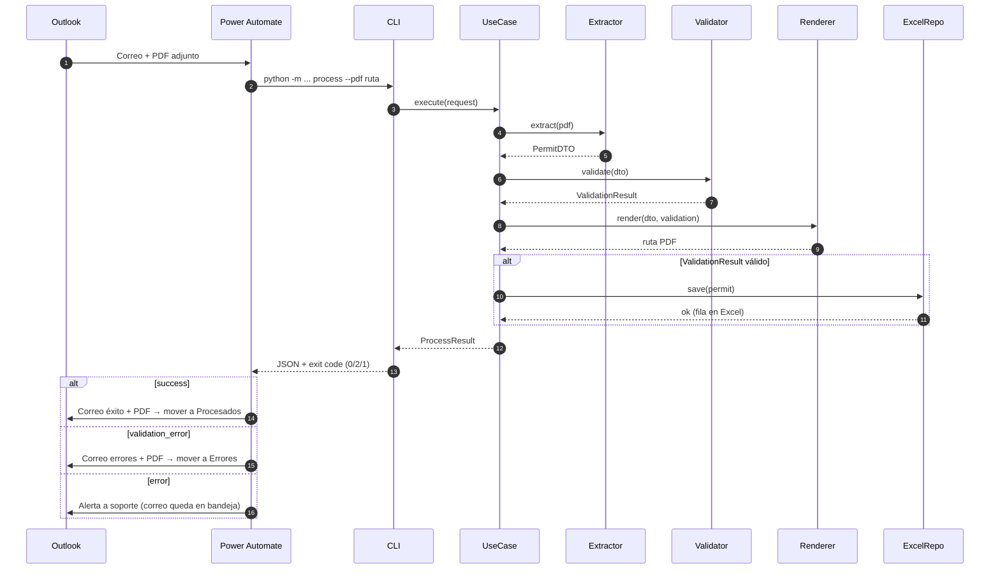
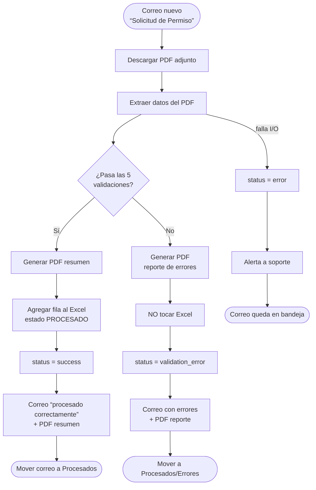
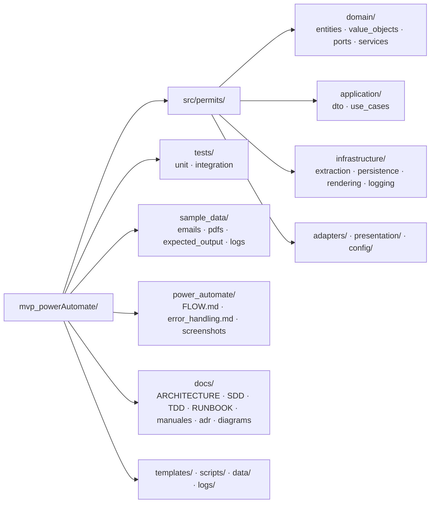
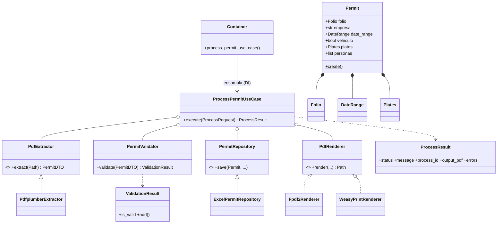

# Diagramas del sistema

Los cinco diagramas del proyecto en Mermaid (renderizan directo en GitHub).
Los de componentes y secuencia también aparecen contextualizados en
[ARCHITECTURE.md](../ARCHITECTURE.md); el de clases, en [TDD.md](../TDD.md).

---

## 1. Diagrama de componentes

## 2. Diagrama de secuencia

## 3. Diagrama de flujo (proceso de negocio)

## 4. Diagrama de carpetas

## 5. Diagrama de clases

